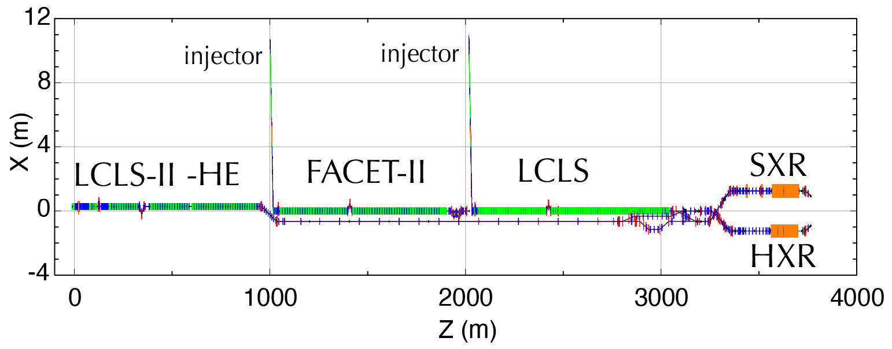
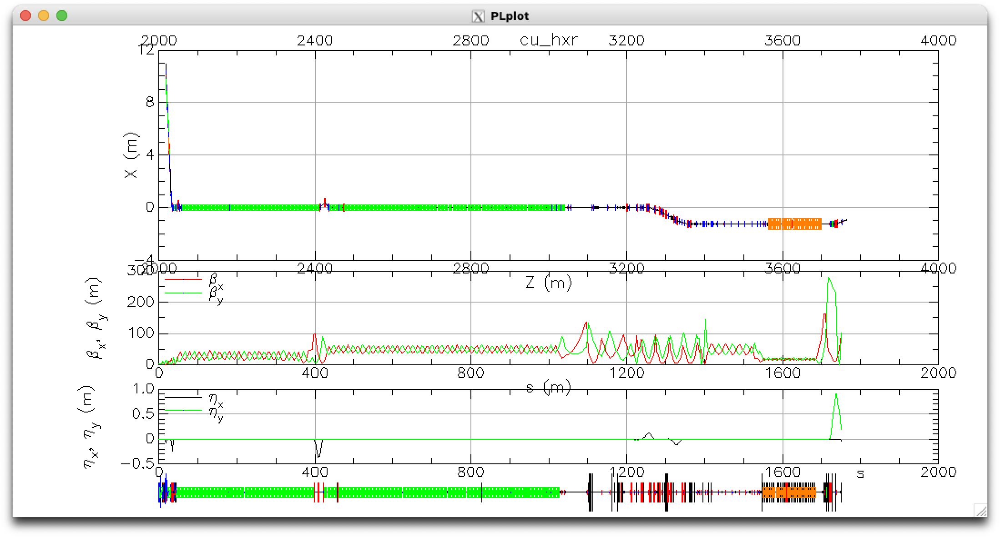
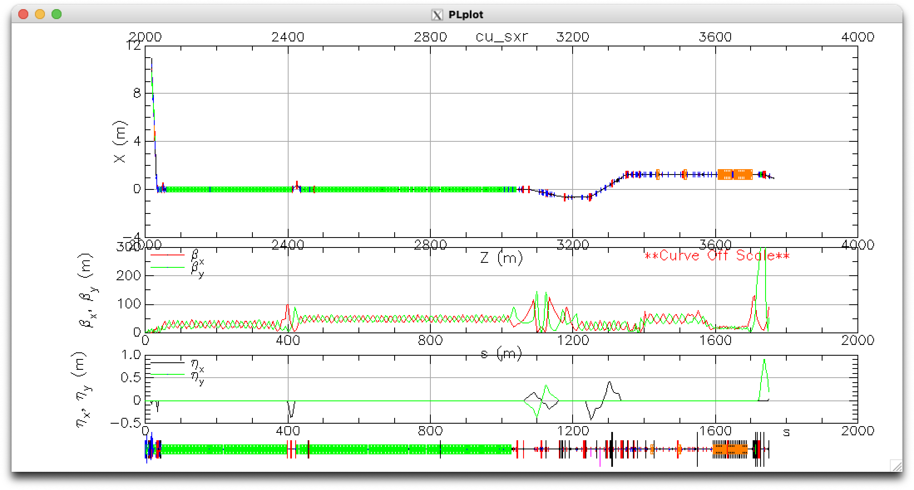

# LCLS-Live

The LCLS accelerator complex consists of multiple electron sources and multiple beam paths.
Live models are computer simulation programs that continuously execute with inputs taken from the machine, and serve physics predictions of the beam behavior.

[**LCLS-Live**](http://github.com/slaclab/lcls-live) is a Python package with related tools and data to help in translating machine settings to simulation models. Currently it is heavly biased towards Bmad models of the accelerators. In the future we will extent it through the X-ray beamlines. 

## Design models

### cu_hxr

### cu_sxr

The input files for various simulation software are collected in the [LCLS-Lattice](https://github.com/slaclab/lcls-lattice) repository (login required).
 

## Simulation software
- [Bmad and Tao](../bmad/index.md) for charged particle beam dynamics.
- [LUME-Impact](https://github.com/ChristopherMayes/lume-impact) for running [Impact-T](https://github.com/impact-lbl/IMPACT-T) from Python.
- [tensorflow](https://www.tensorflow.org/) for neural network-based machine learning (ML) surrogate models. 

## Live Models
### [Live Bmad accelerator models](https://github.com/slaclab/lcls_live_model)
  
- `cu_hxr`
- `cu_sxr`
    
These read magnet and klystron PV at a rate of about 1 Hz, and serve transfer matrices, and Twiss parameters computed from these based on nominal starting conditions.

### [Live cu_inj Impact-T model](https://github.com/ChristopherMayes/lume-impact-live-demo)

 - `cu_inj` currently streaming to <a href="https://www.youtube.com/watch?v=jEFoHcctZMc" target="_blank">YouTube</a>  

### [Live cu_inj surrogate model](https://github.com/slaclab/lcls-cu-inj-live)
    
   
    
- `cu_inj` surrogate currently streaming to <a href="https://www.youtube.com/watch?v=1f42uRNfx18" target="_blank">YouTube</a>    
    
    This is an ML model trained on Impact-T simulations of the `cu_inj` beam path. 

## Future models:
- Bmad models for the `sc_X` for the superconducting linac beam paths. 
- Bunch tracking 
- FEL interaction
- X-ray optics 

