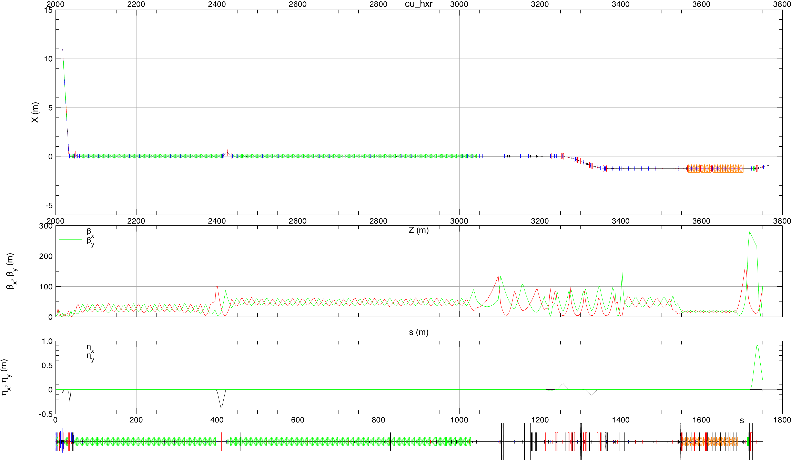
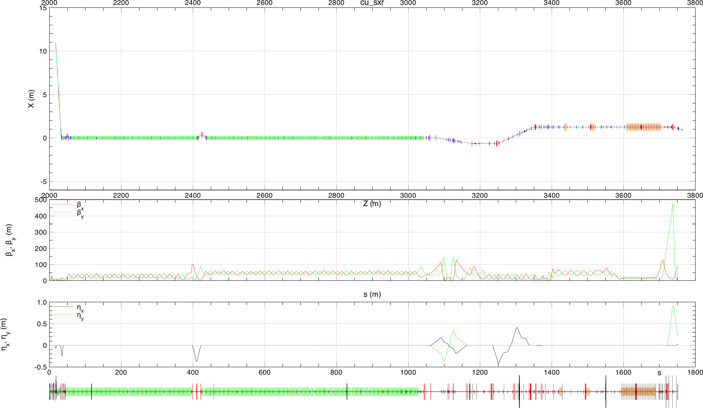
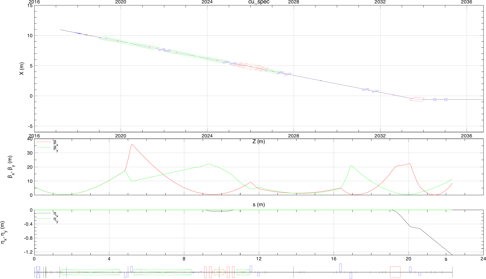
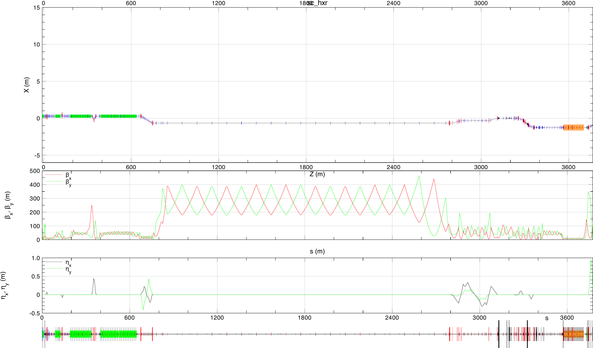
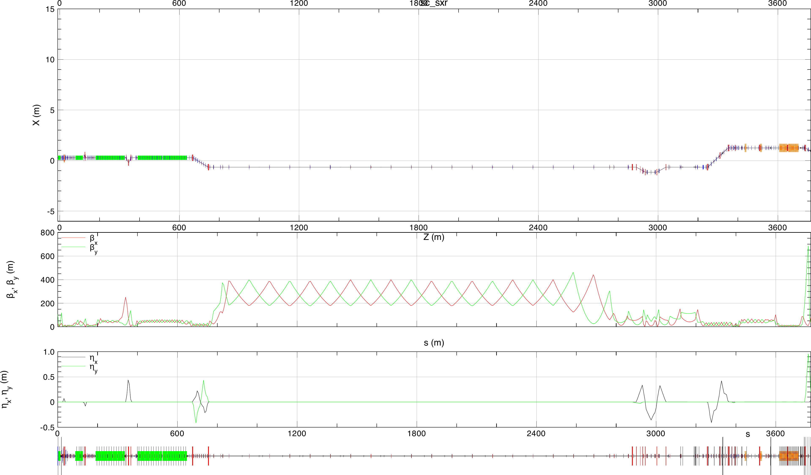
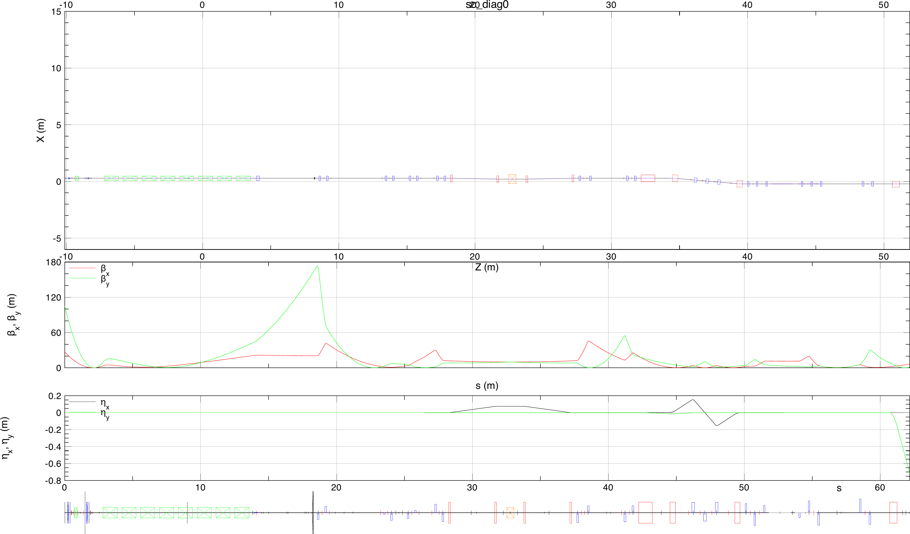
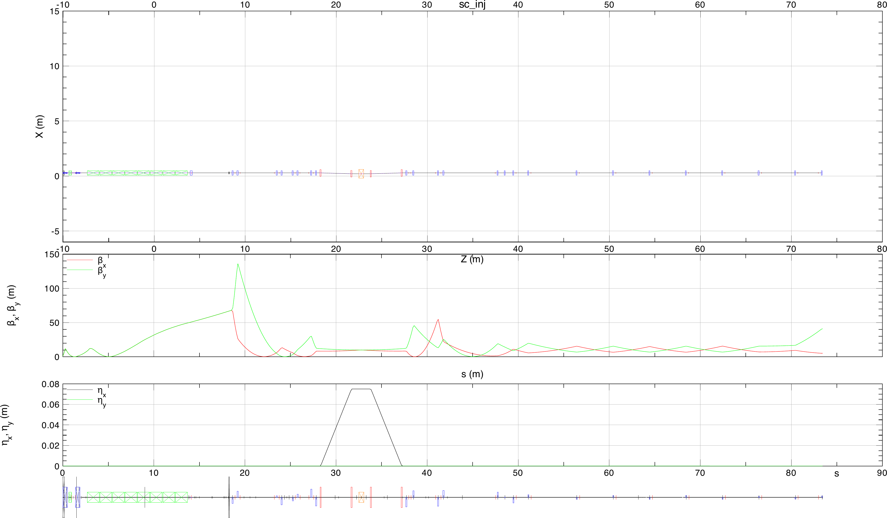
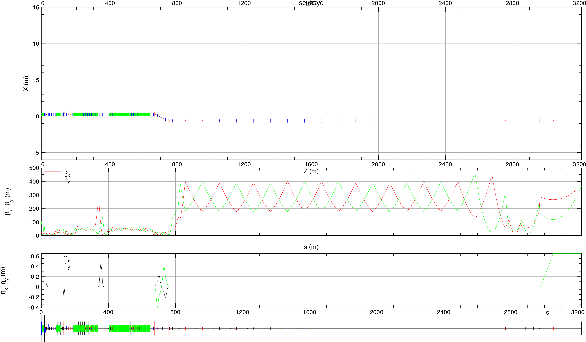
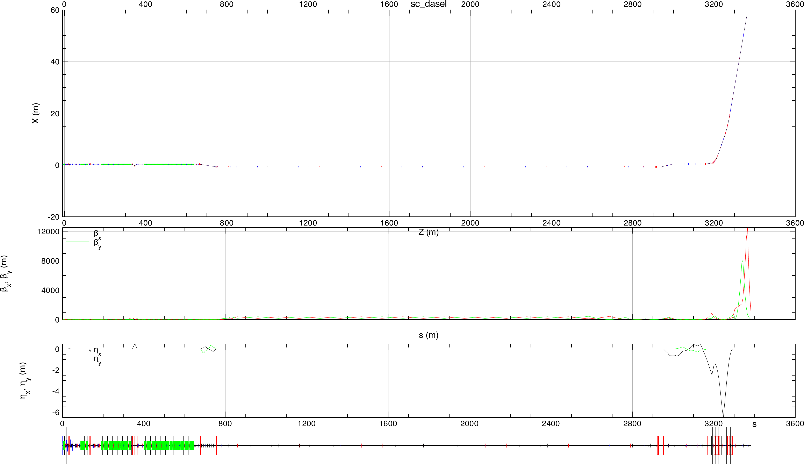

# LCLS-Live

The LCLS accelerator complex consists of multiple electron sources and multiple beam paths.
Live models are computer simulation programs that continuously execute with inputs taken from the machine, and serve physics predictions of the beam behavior.

[**LCLS-Live**](http://github.com/slaclab/lcls-live) is a Python package with related tools and data to help in translating machine settings to simulation models. Currently it is heavly biased towards Bmad models of the accelerators. In the future we will extent it through the X-ray beamlines. 

## Design models

### Copper Linac

===  "cu_hxr"

    
    
===  "cu_sxr"

    
    
===  "cu_spec"

    
    

### Superconducting Linac

    
===  "sc_hxr"

    
    
===  "sc_sxr"

    
    
===  "sc_diag0"

    
    
===  "sc_inj"

    
    
===  "sc_bsyd"

    
    
===  "sc_dasel"

    

The input files for various simulation software are collected in the [LCLS-Lattice](https://github.com/slaclab/lcls-lattice):lock: repository.
 

## Simulation software
- [Bmad and Tao](https://github.com/bmad-sim) for charged particle beam dynamics.
- [LUME-Impact](https://christophermayes.github.io/lume-impact/) for running [Impact-T](https://github.com/impact-lbl/IMPACT-T) from Python.
- [tensorflow](https://www.tensorflow.org/) for neural network-based machine learning (ML) surrogate models. 

